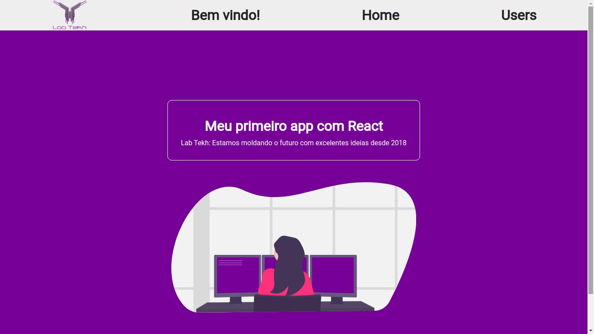

# Workshop de React

Esse workshop foi ministrado nos dias 16, 17 e 31 de Outubro de 2020 para [Lab Tekh](https://labtekh.com.br) e parceiros.

Todo o conteúdo teórico e prático, assim como os materiais de acompanhamento foram criados por @gabriel-paiva, @murilogds e @eliseukadesh67, que também ministraram as aulas.

## Conteúdo Teórico

* O que é React?
* Como o React funciona?
* Introdução a JSX
* React Hooks
* Protocolo HTTP
* Renderização Condicional

## Conteúdo Prático

* Iniciando projeto com Create-react-app
* Criação e estilização de Páginas
* Criação e estilização de Componentes
* Adicionando imagens
* Criação de rotas
* Usando Hooks: useState e useEffect
* Renderizando elementos condicionalmente

## Resultados


<br/>
<br/>


<br/>
<br/>


## Rodando o projeto

1. Clone o projeto com o comando:

``` 
git clone https://github.com/gabriel-paiva/workshopreact
```

2. Entre na pasta do projeto
``` 
cd workshopreact
```

3. Instale as dependências
``` 
npm install
```

4. Suba o servidor
``` 
npm start
```

5. Acesse o projeto pelo navegador na URL: localhost:3000